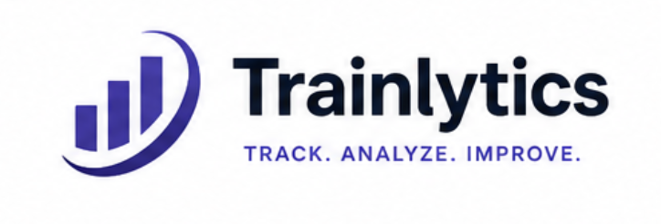

# Trainlytics
<p align="center">
  
</p>

A personal fitness tracking app built for people who want more control, flexibility, and insights than standard fitness apps provide.

Most fitness tools are optimized for a single activity (running, gym, yoga) and make hybrid training difficult to track. Fitness Tracker solves this by providing one customizable place to plan, log, analyze, and review all fitness progress.

---

## Problem

Existing fitness apps are often too rigid:
- Running apps lack detailed strength tracking
- Gym apps ignore cardio metrics like pace or heart rate zones
- Planning and progress analysis are fragmented across multiple tools
- Sharing progress for coaching or AI analysis is inconvenient

Users need one system that adapts to their training style instead of forcing them into predefined workflows.

---

## Solution

Fitness Tracker is a highly customizable fitness dashboard that supports multiple training styles and detailed progress tracking.

Users can:

- Log cardio activities with detailed metrics such as duration, distance, pace, heart rate, and pulse zones
- Log strength sessions with full workout breakdown:
  - exercises
  - sets
  - reps
  - weights
  - progression over time
- Save reusable workout templates for recurring strength sessions
- Build and manage weekly training plans
- Compare planned vs completed workouts
- Track progress through analytical charts and long-term trends
- Export weekly summaries in structured text format for sharing or AI-powered analysis

---

## Core User Stories

### Activity Logging
As a user, I want to log any type of workout with metrics relevant to that activity, so that my training data is complete and useful.

### Strength Training Templates
As a user, I want reusable workout templates with predefined exercises and parameters, so I can log gym sessions faster.

### Weekly Planning
As a user, I want to plan my training week in advance and track completion, so I can stay consistent and accountable.

### Progress Analytics
As a user, I want to see charts of my performance and training volume over time, so I can identify improvements, plateaus, and trends.

### AI-Friendly Export
As a user, I want to export a weekly training summary in text format, so I can easily share it with AI tools or coaches for analysis and recommendations.

---

## Deployment

**Prerequisites:** A Linux server with Docker, Docker Compose, and Git installed. A `.env` file in the repo root with `SECRET_KEY` and `USERS` set (see [tech-stack.md](./specs/tech-stack.md) for details).

**First-time setup:**

```bash
git clone <repo-url>
cd trainlytics
cp .env.example .env   # fill in SECRET_KEY and USERS
bash scripts/deploy.sh
```

**Subsequent deploys** (pull latest code, rebuild containers, run migrations):

```bash
bash scripts/deploy.sh
```

The script performs three steps in order:
1. `git pull` — fetch the latest code from the current branch.
2. `docker compose -f docker-compose.prod.yml up --build -d` — rebuild images and restart containers.
3. `alembic upgrade head` — apply any pending database migrations.

The script is idempotent — safe to run multiple times.

---

## Target User

Fitness Tracker is designed for:
- hybrid athletes combining cardio + strength training
- data-driven fitness enthusiasts
- users experimenting with AI coaching and training optimization

---

## Product Vision

Build a flexible personal fitness operating system:
not just a workout log, but a centralized tool for planning, tracking, analyzing, and continuously improving training.
